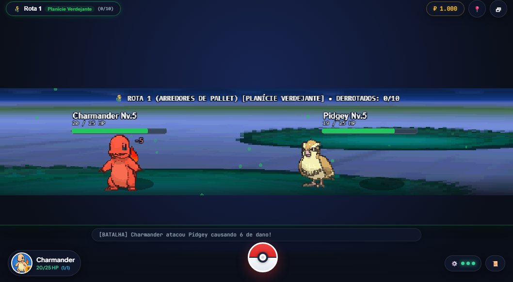
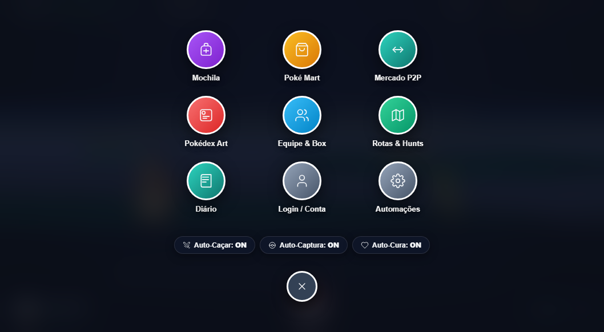
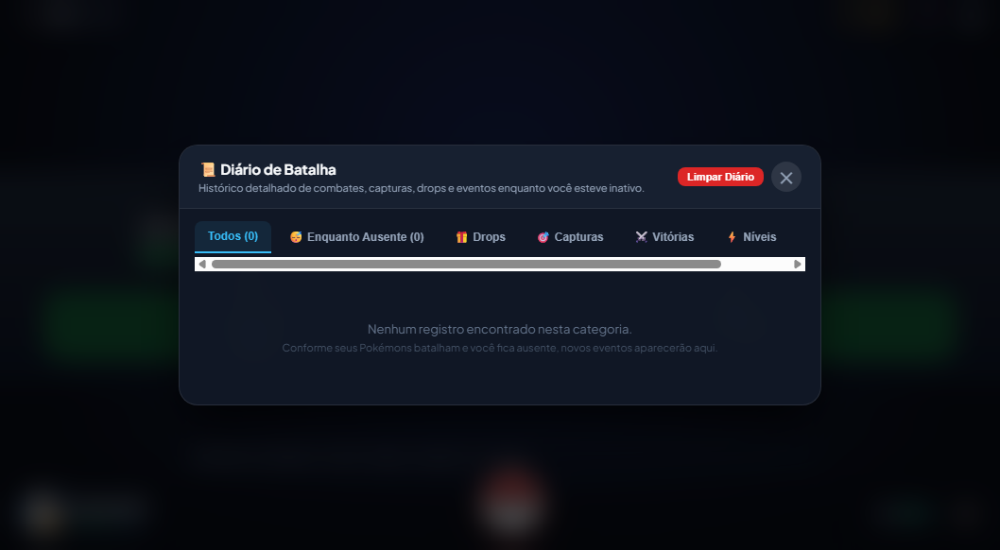
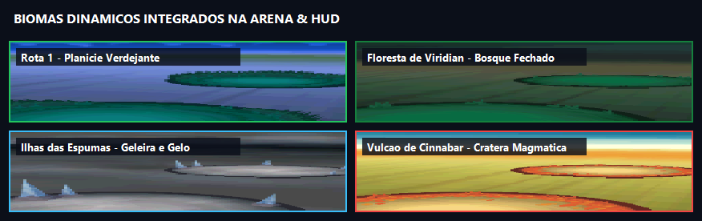
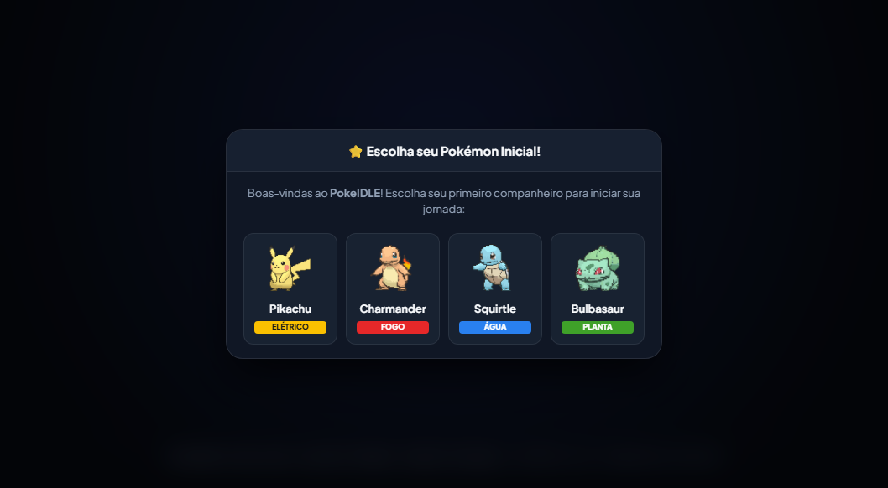
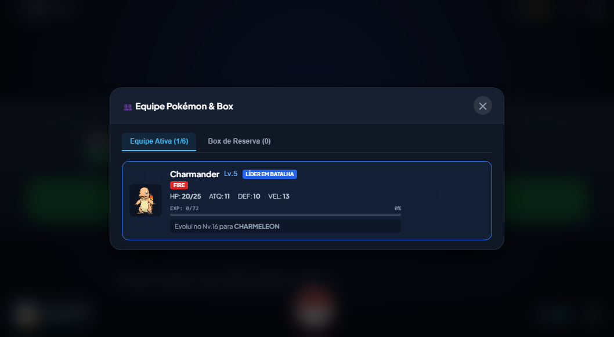
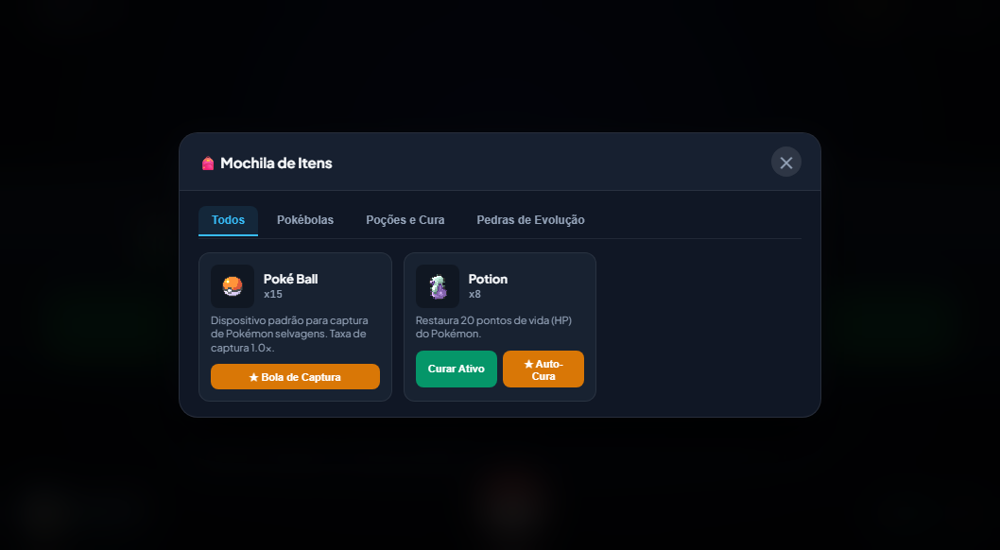
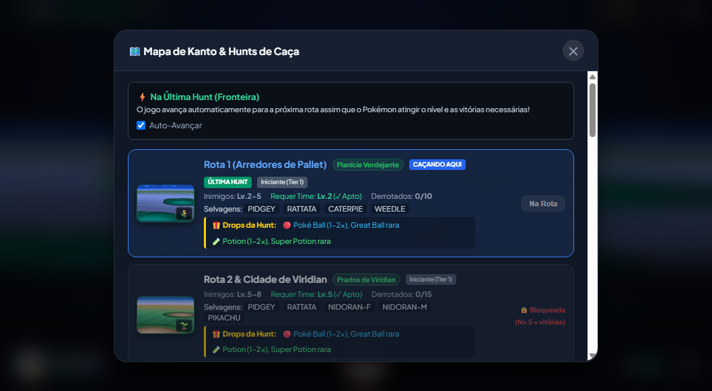
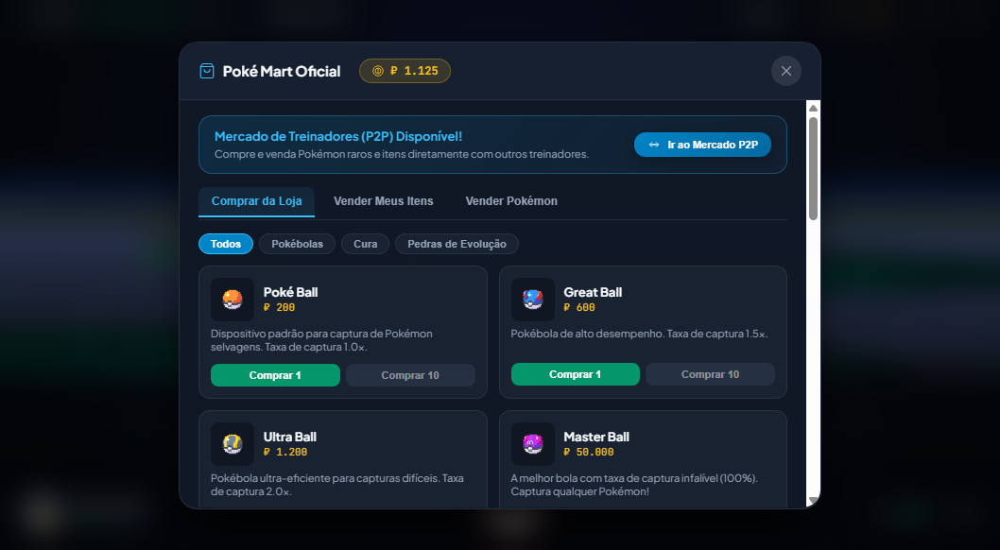
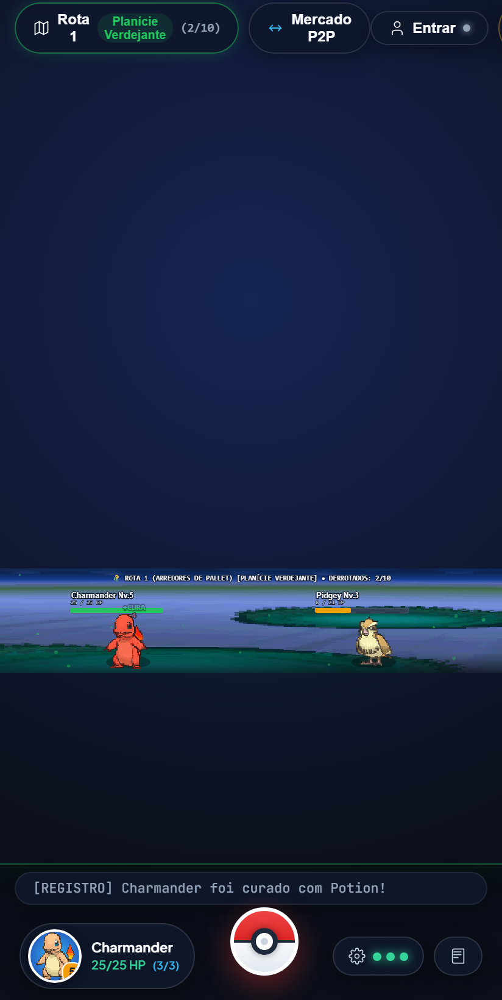

<div align="center">

# ⚔️ PokeIDLE - Pokémon Idle RPG & Miniplayer

**O RPG Pokémon Idle definitivo com combate em tempo real, interface imersiva inspirada no Pokémon GO e automação inteligente.**

[](https://www.typescriptlang.org/)
[](https://phaser.io/)
[](https://vite.dev/)
[](https://www.electronjs.org/)
[](https://pokeapi.co/)
[](LICENSE)

<br/>



<br/>
<br/>

[💡 Além da Pokédex](#-além-da-pokédex-uma-abordagem-inovadora-com-a-pokéapi) •
[🎮 Gameplays e Mecânicas](#-gameplays-e-mecânicas-do-jogo) •
[📸 Galeria do Jogo](#-galeria-de-telas-e-gameplay) •
[🗺️ Rotas & Drops](#️-tabela-de-rotas-hunts-e-drops) •
[🚀 Como Jogar](#-como-executar-e-jogar) •
[🛠️ Arquitetura](#️-arquitetura-do-projeto)

</div>

---

## 💡 Além da Pokédex: Uma Abordagem Inovadora com a PokéAPI

A esmagadora maioria dos projetos que integram a **[PokéAPI](https://pokeapi.co)** se limita à criação de mais uma enciclopédia estática: um campo de busca que puxa uma imagem, os tipos elementais e alguns números de estatísticas. Embora válida como exercício inicial, essa abordagem padronizada mal arranha a superfície da enorme riqueza de dados que a PokéAPI oferece.

O **PokeIDLE** foi concebido com uma proposta radicalmente diferente: **transformar dados brutos de uma API REST pública no coração dinâmico de um motor de RPG em tempo real**.

```
                     ┌────────────────────────────────────────┐
                     │          PokéAPI REST Endpoints        │
                     │  /pokemon, /species, /evolution-chain  │
                     └───────────────────┬────────────────────┘
                                         │  (Async Cache & Offline Fallback)
                                         ▼
                     ┌────────────────────────────────────────┐
                     │         PokeIDLE Game Engine           │
                     └─┬──────────────┬──────────────┬────────┘
                       │              │              │
                       ▼              ▼              ▼
           ┌────────────────┐ ┌────────────────┐ ┌────────────────┐
           │ Real-Time Bump │ │ Growth & EXP   │ │ Dynamic Catch  │
           │ Combat Stats   │ │ Formulas       │ │ & Evolution    │
           │ (Atk, Def, Spe)│ │ (Base EXP, Lv) │ │ (Chains/Items) │
           └────────────────┘ └────────────────┘ └────────────────┘
```

### O que faz essa implementação ser única?

1. **Atributos Reais alimentando Fórmulas de Combate**:
   - Os valores de `attack`, `defense`, `speed` e `hp` retornados pela API não são meros textos na tela: eles alimentam a cadência de colisão em milissegundos (baseada em agilidade) e as fórmulas de cálculo de dano mitigado por defesa em tempo real no Phaser.
2. **Curva de Evolução & Árvores de Espécies Integradas**:
   - A engine consulta a cadeia de evolução (`/evolution-chain`) para identificar automaticamente no código o nível de metamorfose natural (ex: *Charmander Lv. 16 ➔ Charmeleon ➔ Charizard*) ou as exigências de pedras elementares (*Pikachu + Thunder Stone ➔ Raichu*).
3. **Cálculo Fiel de Captura (Catch Rate Math)**:
   - A probabilidade de captura utiliza o atributo oficial `capture_rate` de cada espécie fornecido pela PokéAPI, ponderado pela vida restante do alvo e multiplicado pela eficácia da Pokébola arremessada (*Poké Ball 1.0x*, *Great Ball 1.5x*, *Ultra Ball 2.0x*, *Master Ball 100%*).
4. **Sprites Animados Showdown em Alta Resolução**:
   - Uso de sprites animados GIF oficiais da geração Showdown (`sprites.other.showdown`), garantindo combates vibrantes com colisão física e recuo no canvas 2D.
5. **Resiliência com Cache Local e Fallback Offline**:
   - Um cliente otimizado com cache em `localStorage` e dicionário offline embutido garante carregamento instantâneo, prevenindo gargalos de rede ou bloqueios por *rate-limiting*.

---

## 🎮 Gameplays e Mecânicas do Jogo

### 1. Batalhas por Aproximação em Tempo Real (*Bump Combat*)
O combate ocorre em uma pista horizontal estilizada no **Phaser 3**. Os Pokémons se movem em direção ao centro em intervalos sincronizados com a velocidade de cada criatura:
- **Impacto Físico**: Ao colidirem, recuam com efeito elástico de tween e tela com leve vibração.
- **Dano Dinâmico**: Números flutuantes indicam dano normal, acertos críticos em vermelho vibrante (`CRÍTICO! -28`) ou curas em verde (`+20 HP`).
- **Barra de HP Colorimétrica**: Transição suave de verde (>50%), amarelo (20%-50%) e vermelho (<20%).

### 2. HUD Flutuante Inspirado no Pokémon GO (Glassmorphism)
Interface moderna translúcida com desfoque de fundo (*backdrop blur*) que mantém o foco total na arena de batalha:
- **Barra Superior**: Pílula indicando a Hunt ativa, progresso de vitórias, saldo de Pokédollars (₽) e botão de fixação (Pin/Always on Top).
- **Botão 3D Central de Pokébola**: Uma esfera em alto relevo com iluminação 3D. Ao clicar, ativa um menu radial circular em tela cheia com atalhos para todas as áreas do jogo.
- **Card do Companheiro (Buddy)**: Exibe no canto inferior o Pokémon líder ativo, seu nível atual e HP em tempo real com atalho direto para a equipe.
- **Indicadores de Automação**: Painel de LEDs luminosos mostrando o status do *Auto-Caçar*, *Auto-Capturar* e *Auto-Curar*.

<div align="center">
  
  <p><em>Menu radial translúcido estilo Pokémon GO com atalhos rápidos e alternadores de automação.</em></p>
</div>

### 3. Progressão Dinâmica por Nível & Caça Manual
O mundo é dividido em Hunts progressivas pela região de Kanto:
- **Requisito de Nível do Time**: Cada hunt exige um nível mínimo da sua equipe para liberar acesso seguro e progressão.
- **Fronteira & Auto-Avanço**: Ao derrotar o número de inimigos exigido na sua rota mais avançada (**Última Hunt**), o jogo avança automaticamente para a próxima zona de combate.
- **Treino e Farming Manual**: O jogador pode livremente clicar no mapa e voltar para qualquer rota anterior para subir o nível de novos Pokémons. Ao fazer isso, o jogo **pausa o avanço automático**, permitindo grindar sem riscos. Quando o jogador retornar à sua última rota desbloqueada, o auto-avanço é retomado automaticamente.

### 4. Sistema de Drops por Dificuldade de Hunt
Ao concluir cada combate, os inimigos derrotados derrubam suprimentos fundamentais para a jornada. A quantidade e qualidade escalam de acordo com a dificuldade da hunt:
- **Tier 1 (Iniciante)**: Pokébolas comuns e Poções básicas.
- **Tier 2 (Intermediário)**: Great Balls e Super Poções com chances raras de Ultra Balls.
- **Tier 3 (Avançado)**: Ultra Balls e Hyper Poções com chances raras de Max Potions.
- **Tier 4 (Lendário/Fim de Jogo)**: Max Potions, Full Restores, Ultra Balls e chances de Master Ball.

### 5. Diário de Batalha & Relatório de Ausência (*Idle Detection*)
Nunca perca nada do que acontece enquanto a janela está minimizada ou rodando em segundo plano:
- **Filtros por Categoria**: Registros completos separados por *Drops*, *Capturas*, *Vitórias*, *Níveis* e *Eventos Gerais*.
- **Enquanto Você Esteve Ausente**: Sistema inteligente que monitora inatividade (mais de 15 segundos sem interação ou perda de foco da janela). Ao retornar, exibe um painel de boas-vindas com o resumo de tudo o que foi acumulado: batalhas vencidas, moedas ganhas, itens dropados e Pokémons capturados.

<div align="center">
  
  <p><em>Diário de Batalha com categorização completa e resumo de progresso ausente.</em></p>
</div>

### 6. Desmaio do Time & Reviver Interativo
Quando todos os membros conscientes da equipe caem em combate:
- A caça é imediatamente interrompida por segurança.
- O jogador é convidado a interagir: pode reviver individualmente cada Pokémon por **₽ 10** ou reorganizar a equipe trazendo reservas saudáveis da **Box**.
- Essa mecânica remove o "game over definitivo" sem retirar o impacto estratégico da gestão de time e economia.

### 7. Gestão de Equipe, Box de Armazenamento e Mochila
- **Equipe (Party)**: Até 6 Pokémons ativos. Escolha qualquer membro para ser o Líder em Combate ou envie para a Box de Reserva.
- **Mochila (Bag)**: Utilize poções manualmente, configure a poção predileta do Auto-Heal e escolha qual Pokébola deve ser a padrão de arremesso.
- **Evoluções com Pedras**: Use pedras elementares diretamente da mochila para despertar formas avançadas (Vaporeon, Jolteon, Flareon, Raichu, etc.).

### 8. Poké Mart & Mercado
- Compre e venda itens em pacotes unitários ou em lote (**x10**).
- Venda Pokémons duplicados da Box ou da equipe por Pokédollars calculados com base no nível e estágio evolutivo.

### 9. 🌌 Biomas Autênticos Dinâmicos & Integração com o HUD
Cada uma das 12 rotas e zonas de caça conta com um campo de batalha próprio extraído e ampliado dos cenários oficiais de combate Pokémon (geração Black/White em alta definição), integrado perfeitamente ao ecossistema do HUD:
- **Plataformas de Combate em Isometria**: O Pokémon ativo do jogador e o adversário selvagem se posicionam exatamente sobre as bases de combate autênticas com sombras dinâmicas projetadas.
- **Sistema de Partículas & Física Atmosférica**:
  - *Vulcão de Cinnabar*: Faíscas e brasas quentes subindo pelo ar.
  - *Ilhas das Espumas*: Flocos de neve e cristais de gelo caindo suavemente.
  - *Floresta de Viridian*: Folhas verdes e pólen flutuando com a brisa.
  - *Torre Pokémon (Lavender)*: Névoa espectral e orbes fantasmagóricos violetas.
  - *Rios e Mares*: Gotículas e partículas de água reluzentes.
  - *Montanhas e Cavernas*: Partículas de poeira e feixes de luz dourada.
- **Bordas & Brilho Neon Reativo no HUD**: O contorno da janela de combate e a pílula de rota no HUD assumem dinamicamente a tonalidade elemental do bioma ativo (Esmeralda na Floresta, Magma no Vulcão, Ciano Glacial no Gelo, Roxo na Torre Fantasma).
- **Cards com Miniaturas de Bioma no Mapa**: O menu de rotas exibe a miniatura real de cada bioma com ícone ambiental e requisitos de nível.

<div align="center">
  
  <p><em>Quatro dos doze biomas oficiais adaptados para a arena e iluminados pelo HUD.</em></p>
</div>

### 10. Miniplayer no Canto da Tela (Estilo YouTube PiP) & Desktop Electron
- O jogo conta com um modo **Always on Top** nativo no Electron e atalhos dedicados para execução em janela compacta via Chrome ou Edge (`--app=http://localhost:5173 --window-size=440,280`), perfeito para acompanhar o farm no canto da barra de tarefas enquanto estuda ou trabalha.

---

## 📸 Galeria de Telas e Gameplay

<div align="center">

| 1. Escolha do Inicial | 2. Arena de Batalha & Bioma Integrado |
| :---: | :---: |
|  |  |

| 3. Menu Radial Pokémon GO | 4. Diário de Batalha |
| :---: | :---: |
|  |  |

| 5. Equipe Pokémon & Box | 6. Mochila de Itens |
| :---: | :---: |
|  |  |

| 7. Mapa com Miniaturas de Bioma | 8. Poké Mart & Trocas |
| :---: | :---: |
|  |  |

| 9. Experiência Mobile & Bottom Sheets |
| :---: |
|  |

</div>

---

## 🗺️ Tabela de Rotas, Hunts e Biomas

| ID | Nome da Rota / Hunt | Bioma & Clima | Inimigos | Nv. Rec. | Drops Principais | Tier |
| :--- | :--- | :--- | :--- | :---: | :--- | :---: |
| **route-1** | Rota 1 (Arredores de Pallet) | 🌾 Planície Verdejante | Pidgey, Rattata, Caterpie, Weedle | Nv. 2 | Poké Ball (1-2x), Potion (1-2x) | `Iniciante` |
| **route-2** | Rota 2 & Cidade de Viridian | 🌱 Prados de Viridian | Pidgey, Rattata, Nidoran, Pikachu | Nv. 5 | Poké Ball (1-2x), Potion (1-2x) | `Iniciante` |
| **viridian-forest** | Floresta de Viridian | 🌲 Bosque Fechado | Caterpie, Metapod, Weedle, Kakuna, Pikachu | Nv. 6 | Poké Ball (1-3x), Potion (1-2x) | `Iniciante` |
| **route-3** | Rota 3 & Caminho de Pewter | ⛰️ Cordilheira Rochosa | Spearow, Zubat, Mankey, Geodude | Nv. 9 | Poké Ball (1-3x), Potion (1-2x) | `Iniciante` |
| **mt-moon** | Monte Lua (Mt. Moon) | 🌙 Caverna Lunar | Zubat, Geodude, Paras, Clefairy, Onix | Nv. 11 | Great Ball (1-2x), Super Potion (1-2x) | `Intermediário` |
| **route-4** | Rota 4 & Rio de Cerulean | 💧 Margem Fluvial | Ekans, Oddish, Bellsprout, Poliwag, Psyduck | Nv. 14 | Great Ball (1-2x), Super Potion (1-2x) | `Intermediário` |
| **vermilion-route** | Rota 11 (Litoral de Vermilion) | 🏖️ Praia Costeira | Drowzee, Meowth, Magnemite, Diglett | Nv. 18 | Great Ball (1-3x), Super Potion (1-2x) | `Intermediário` |
| **rock-tunnel** | Túnel de Pedra (Rock Tunnel) | ⛏️ Túnel Subterrâneo | Machop, Geodude, Graveler, Onix | Nv. 22 | Ultra Ball (1-2x), Hyper Potion (1-2x) | `Avançado` |
| **pokemon-tower** | Torre Pokémon (Lavender Town) | 👻 Cemitério Noturno | Gastly, Haunter, Cubone, Marowak | Nv. 25 | Ultra Ball (1-2x), Hyper Potion (1-2x) | `Avançado` |
| **safari-zone** | Zona do Safari | 🦁 Savana Selvagem | Scyther, Pinsir, Tauros, Dratini, Chansey | Nv. 30 | Ultra Ball (1-3x), Hyper Potion (1-2x) | `Avançado` |
| **seafoam-islands** | Ilhas das Espumas (Seafoam) | ❄️ Geleiras e Caverna de Gelo | Seel, Dewgong, Shellder, Slowpoke, Staryu | Nv. 35 | Ultra Ball (2-4x), Max Potion (1-2x) | `Lendário` |
| **cinnabar-volcano** | Vulcão de Cinnabar | 🌋 Cratera Magmática | Ponyta, Growlithe, Magmar, Koffing, Weezing | Nv. 40 | Ultra Ball (2-4x), Max Potion, Full Restore | `Lendário` |

---

## 🚀 Como Executar e Jogar

### Pré-requisitos
- **[Node.js](https://nodejs.org)** (versão 18 ou superior instalada)
- Gerenciador de pacotes `npm`

### 1. Clonar o Repositório & Instalar Dependências
```bash
git clone https://github.com/menezesjuan/PokeIDLE.git
cd PokeIDLE
npm install
```

### 2. Modo Web (Navegador)
Inicia o servidor de desenvolvimento Vite super-rápido:
```bash
npm run dev
```
Abra o navegador em `http://localhost:5173`. O jogo se adapta tanto a telas largas de computador quanto a telas de smartphones.

### 3. Modo Desktop Miniplayer (Electron)
Executa o jogo em janela dedicada do Electron com suporte a fixação na tela (*Always on Top*):
```bash
npm run electron:dev
```

### 4. Modo Miniplayer de Canto (Chrome / Edge PiP)
Se preferir rodar como aplicativo web de canto fino (estilo picture-in-picture do YouTube):
```bash
# Para Google Chrome:
npm run chrome:pip

# Para Microsoft Edge:
npm run edge:pip
```

---

## 🛠️ Arquitetura do Projeto

```
PokeIDLE/
├── electron/
│   ├── main.cjs                # Processo principal do Electron (janela compacta, PiP, Always-on-top)
│   └── preload.cjs             # Bridge IPC seguro para desktop
├── src/
│   ├── api/
│   │   ├── pokeApi.ts          # Cliente assíncrono com cache e fallback offline
│   │   ├── routesData.ts       # Configuração das 12 Hunts de Kanto e requisitos de nível
│   │   ├── dropsData.ts        # Tabelas de drop rate progressivas por Hunt
│   │   └── itemsData.ts        # Catálogo de Pokébolas, Poções e Pedras evolutivas
│   ├── game/
│   │   ├── BattleScene.ts      # Cena de combate Phaser 3 (física, animações, bumps e tweens)
│   │   └── config.ts           # Configurações de renderização do Phaser
│   ├── state/
│   │   ├── gameState.ts        # Store global reativa (Party, Box, Mochila, Economia, Progresso)
│   │   ├── battleEngine.ts     # Loop de combate idle, auto-hunt, auto-catch e auto-heal
│   │   └── activityLog.ts      # Registro estruturado de eventos e detecção de ausência (Idle)
│   ├── ui/
│   │   ├── HUD.ts              # Top bar, Bottom hub estilo Pokémon GO e Menu Radial
│   │   ├── BagModal.ts         # Modal da Mochila de Itens
│   │   ├── TeamModal.ts        # Modal da Equipe e Box de Reserva
│   │   ├── ShopModal.ts        # Poké Mart e Centro de Trocas
│   │   ├── RoutesModal.ts      # Seletor de Hunts, Mapa e Toggle de Auto-Avanço
│   │   ├── LogModal.ts         # Diário de Batalha com resumo "Enquanto esteve fora"
│   │   └── ReviveModal.ts      # Interface interativa de recuperação após derrota
│   ├── styles/
│   │   └── style.css           # Glassmorphism, temas Pokémon GO, animações e responsividade mobile
│   └── main.ts                 # Ponto de entrada da aplicação e seleção de Inicial
├── docs/
│   └── images/                 # Capturas de tela e assets visuais oficiais
├── package.json
└── vite.config.ts
```

---

## 📄 Licença

Distribuído sob a licença **ISC**. Consulte `LICENSE` para mais informações.

*Pokémon e nomes de personagens são marcas registradas da Nintendo, Creatures Inc. e Game Freak. Este projeto é de cunho educacional e experimental sem fins lucrativos.*
